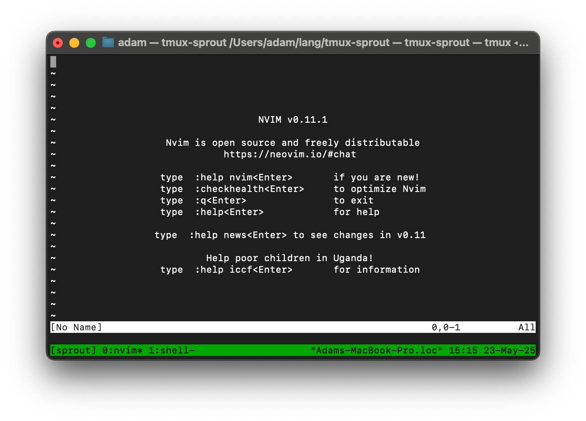

# Tmux Sprout

<div align="center">
    
</div>

A simple C program to hydrate your tmux sessions. Takes [Primeagen's tmux-sessionizer](https://github.com/ThePrimeagen/tmux-sessionizer) to the next level.

In addition to creating/switching tmux sessions, `tmux-sprout` *hydrates* them as well. This means when you open a new session, you can write a simple configuration file to specify what tabs and projects to open.

As a side effect, it also greatly simplifies your `tmux-sessionizer` file:

```sh
selected=$(find ~/path1 ~/path2/path3 -mindepth 1 -maxdepth 1 -type d | fzf)

if [[ -z $selected ]]; then
    exit 0
fi

tmux-sprout "$selected"
```

## How it works

When you call `tmux-sprout [path]`, a tmux session will be opened to the specified path. If the session exists it will be opened, otherwise it will be created.

When a session is created, the config file is searched for matching paths. If a match is found, those settings will be used to open all your windows and applications.

For example, when doing web dev, I often have a window for neovim, a window to run my watch rebuild script, and a window for running git commands in.

## Installation

No binaries are provided. Compiling with [Meson](https://mesonbuild.com/SimpleStart.html) is very easy.

Tested on macOS. Theoretically works on Linux.

Setup:
```sh
git clone https://github.com/AdamGaskins/tmux-sprout.git tmux-sprout
cd tmux-sprout
meson setup buildDir
```

Compile:
```sh
meson compile -C buildDir
```

Run:
```sh
./buildDir/tmux-sprout
```

Link:
```sh
sudo ln -sf $(realpath ./buildDir/tmux-sprout) /usr/local/bin/tmux-sprout
```

## Configuration Example

Configuration is looked for at:
* `$XDG_CONFIG_DIR\tmux-sprout.toml`
* `$HOME\tmux-sprout.toml`
* `tmux-sprout.toml`

```toml
# Create a new entry in the projects array for each project

[[projects]]
name = "My project"                 # The name of the tmux session
folder = "/Users/adam/file"         # The full path to the folder
tabs.shell = ""                     # Opens a window named "shell"

[[projects]]
name = "Dotfiles"
folder = "/Users/adam/.dotfiles"
tabs.editor = "nvim"                # Opens a window named "editor" with neovim
tabs.shell = ""

# You can also specify partial paths for "folder".
# This will match any folder named "web-project" inside another folder named "lang".
[[projects]]
name = "Web Project"
folder = "lang/web-project"
tabs.nvim = "nvim"
tabs.build = "npm run dev"
tabs.shell = ""
```
